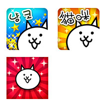
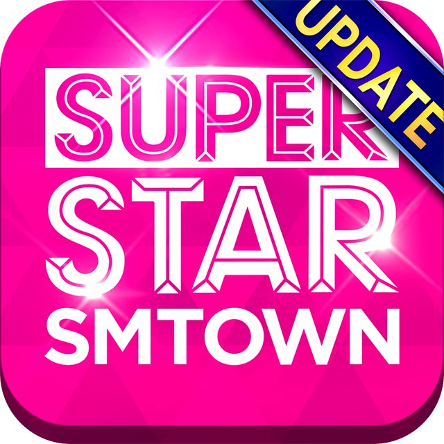

Full-Stack PHP Developer

# About Me
I'm a full-stack developer based in Texas with over 4 years of experience building and maintaining high-traffic web applications. I specialize in PHP/MySQL backend development with strong frontend capabilities, currently managing dalsaram.com—a Korean-American community portal serving 10,000+ daily active users and handling 300,000+ monthly visits.
With a background spanning both backend development and frontend implementation, I bring a comprehensive understanding of the full web development lifecycle. After receiving my green card, I'm actively seeking full-time opportunities where I can contribute to impactful products in a collaborative team environment.

# 💼Professional Experience
## Full-Stack Developer @ Dalsaram
2024 - Present | Texas, USA

Lead development and maintenance of high-traffic community portal (10K+ DAU, 300K+ monthly visits)
Architect and implement full-stack features using PHP 8.3, MySQL 8.0, JavaScript, and Tailwind CSS
Optimize database queries and server performance for scalability

## Frontend Engineer @ PONOS Corporation
2014 - 2022 | Tokyo, Japan

Developed and maintained web interfaces for mobile game franchises (The Battle Cats, Superstar series)
Built responsive landing pages, event sites, and help documentation portals
Collaborated with designers and backend teams to implement pixel-perfect UI components

## UI Developer @ CAPCOM
2010 - 2013 | Tokyo, Japan
Implemented frontend interfaces for gaming web properties
Created interactive promotional sites and event pages

## Frontend Developer @ WEMADE JAPAN
2009 - 2010 | Tokyo, Japan

## Junior Developer @ KYOBO Information & Communication
2007 - 2009 | Tokyo, Japan

# 🎓 Education
- Open Cyber University — Information & Communication Engineering (2008-2010)
- Induk University — Visual Design (2004-2006)

# 🛠 Technical Skills
**Backend**: PHP (5.x → 8.3), MySQL (5.6 → 8.0), SQL Optimization, RESTful APIs   
**Frontend**: JavaScript (ES6+), jQuery, HTML5, CSS3, Tailwind CSS, Responsive Design  
**DevOps & Tools**: Git, Apache, Linux (Ubuntu/CentOS), cPanel, Shell scripting, Cron jobs  
**Database**: MySQL, phpMyAdmin, Query Optimization, Database Migration  
**Development Tools**: VSCode, Git, Bitbucket, SourceTree, FTP/SFTP  
**Collaboration**: Jira, Confluence, Slack, Figma  
**Currently Learning**: React, Laravel, Supabase, Docker, SAP Fiori (UI5)  

# 🚀 Featured Projects
## Dalsaram.com — Korean Community Portal
**Role**: Lead Full-Stack Developer & Technical Maintainer  
**Duration**: 2024 - Present  
**Tech Stack**: PHP 8.3, MySQL 8.0.42, JavaScript, jQuery, Tailwind CSS, Apache  

**Overview**  
A comprehensive community platform serving the Korean-American community in Texas with classifieds, business directories, forums, and local announcements.
Key Metrics

10,000+ daily active users
300,000+ monthly visits
99.9% uptime maintained

**Technical Achievements**  
Legacy Migration: Led complete migration from PHP 5.x to 8.3 and MySQL 5.6 to 8.0.42 with zero data loss
Performance Optimization: Reduced query response time by 30% through SQL optimization and indexing strategies
Architecture Refactoring: Modularized monolithic codebase into reusable components (board system, search engine, tagging system)
Security Enhancements: Implemented SQL injection protection, spam filtering, and input validation layers
Feature Development: Built custom content management system with role-based access control and dynamic menu/tag filtering
Database Management: Designed and optimized database schemas for high-concurrency scenarios
Incident Recovery: Resolved critical 500 errors through memory profiling and server configuration optimization

**Technical Highlights**  
<details>
<summary><b>📋 View Technical Implementation</b></summary>

&nbsp;

**Modularized Board Controller with Security Enhancements**
```php
class BoardController {
    private $db;
    
    public function getPostsByTag($tagId, $limit = 20) {
        $stmt = $this->db->prepare(
            "SELECT p.*, u.username FROM posts p 
             JOIN users u ON p.user_id = u.id 
             WHERE p.tag_id = ? ORDER BY p.created_at DESC LIMIT ?"
        );
        $stmt->bind_param("ii", $tagId, $limit);
        return $stmt->execute() ? $stmt->get_result()->fetch_all(MYSQLI_ASSOC) : null;
    }
}
```

</details>

---

## DalTube — Video Content Platform  
**Role**: Full-Stack Developer  
**Tech Stack**: PHP, MySQL, JavaScript, YouTube API

**Features Implemented**  
YouTube video integration with custom tagging system
Category-based content filtering and search
Admin dashboard for content management (upload, tag, sort)
Responsive video player with playlist functionality

## Dalsaram Admin Dashboard
**Role**: Backend & Frontend Developer  
**Description**: Internal CMS for managing site content, users, and analytics  

**Key Features**  
User role management and permission system
Content moderation tools with bulk actions
Real-time analytics dashboard
Database backup and maintenance tools


## Ad Banner Management System
**Role**: Full-Stack Developer  
**Tech Stack**: PHP, MySQL, JavaScript  

**Functionality**  
Dynamic banner rotation system with time-based scheduling
Click-through rate (CTR) tracking and analytics
Session-based impression counting
Admin interface for campaign management

# 🎮 Frontend Engineering Projects (Game Industry)
## The Battle Cats — Multi-Regional Web Properties
**Company**: PONOS Corporation (2014-2022)  
**Role**: Frontend Engineer  
**Regions**: English, Korean, Chinese, European (DE/IT/ES)  

**Responsibilities**  
Developed responsive landing pages and promotional sites using HTML5/CSS3/JavaScript
Built interactive event pages with animations and real-time countdown timers
Implemented help documentation portals with search functionality
Created localized UI components for multi-language support
Optimized frontend performance for mobile-first experience



**Technical Implementation**  
Vanilla JavaScript for interactive elements and API integrations
CSS3 animations and transitions for engaging user experience
Responsive grid layouts using Flexbox/Grid
Cross-browser compatibility testing and optimization

## SUPERSTAR Series (SMTOWN / BTS / PLEDIS) — Japan Region
**Company**: PONOS Corporation (2017-2020)  
**Role**: Frontend Developer  

**Delivered**  
Mobile-optimized event landing pages
App store download pages with device detection
Interactive promotional campaigns with form validation
Real-time event status updates using AJAX

 


# 📫 Contact
**Location**: Texas, USA  
**GitHub**: @tyey  
**LinkedIn**: <a href="https://www.linkedin.com/in/tyeyty" target="_blank">Linkedin</a>    
**Email**: tyeyty@gmail.com  
**Portfolio**: <a href="https://tyeyty.vercel.app/" target="_blank">Portfolio Site</a>  

# 💡 What I'm Looking For
I'm seeking a full-stack or backend-focused role where I can:

Build scalable web applications with modern PHP frameworks
Contribute to architectural decisions and code quality
Collaborate with cross-functional teams
Mentor junior developers and share knowledge
Work with modern DevOps practices (Docker, CI/CD)

Open to: Remote, Hybrid in Texas
