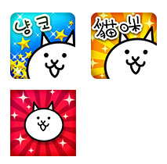
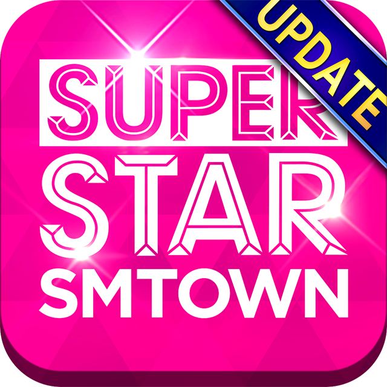

# Full-Stack Developer GH Jo

# 📫 Contact
**Location**: Texas, USA  
**GitHub**: @tyeyty  
**LinkedIn**: <a href="https://linkedin.com/in/tyeyty" target="_blank" rel="noopener noreferrer">
  
</a> 🔗  
**Email**: tyeyty@gmail.com  
**Portfolio**: [Portfolio Site](https://tyeyty.vercel.app/) 🌐 

# 🛠 Technical Skills
**Backend**: PHP (5.x → 8.3), MySQL (5.6 → 8.0), SQL Optimization, RESTful APIs, Next.js, Node,js   
**Frontend**: JavaScript (ES6+), jQuery, HTML5, CSS3, Tailwind CSS, Responsive Design, React  
**DevOps & Tools**: Git, Apache, Linux (Ubuntu/CentOS), cPanel, Shell scripting, Cron jobs  
**Database**: MySQL, phpMyAdmin, Query Optimization, Database Migration, Supabase  
**Development Tools**: VSCode, Git, Bitbucket, SourceTree, FTP/SFTP  
**Collaboration**: Jira, Confluence, Slack, Figma  
**Currently Learning**: React, Laravel, Supabase, Docker, SAP Fiori (UI5)  

# About Me
## Senior Full-Stack Engineer & UI/UX Expert
Seasoned developer with a deep foundation in both visual design and  
engineering, specializing in high-traffic platforms (10K+ DAU) and AI-integrated SaaS.  
Expert in building modern web architectures using Next.js, TypeScript, and PHP 8.3, with a proven track record at global leaders like Capcom and Ponos.  
Passionate about leveraging AI agents to accelerate the SDLC and deliver aesthetically superior, user-centric products.  
U.S. Green Card holder ready for immediate full-time or part-time opportunities.

# 💼Professional Experience
## Full-Stack Developer @ Dalsaram  
2024 - Present | Texas, USA  
Lead development and maintenance of high-traffic community portal (10K+ DAU, 300K+ monthly visits)  
Architect and implement full-stack features using PHP 8.3, MySQL 8.0, JavaScript, and Tailwind CSS  
Optimize database queries and server performance for scalability  

## Frontend Engineer @ PONOS Corporation
2014 - 2022 | Tokyo, Japan  
Developed and maintained web interfaces for mobile game franchises (The Battle Cats, Superstar series)  
Built responsive landing pages, event sites, and help documentation portals  
Collaborated with designers and backend teams to implement pixel-perfect UI components  

## Additional Professional Experience (2004 – 2013)
**UI Developer** | CAPCOM | Tokyo, Japan (2010 – 2013)  
**Frontend Developer** | WEMADE JAPAN | Tokyo, Japan (2009 – 2010)  
**Junior Developer** | KYOBO Information & Communication | Tokyo, Japan (2007 – 2009)  
**Junior Web Designer** | GJ Design | Seoul, Korea (2004 – 2006)

# 🚀 Featured Projects
## Dalsaram.com — Korean Community Portal
URL: <a href="https://dalsaram.com" target="_blank" rel="noopener noreferrer">dalsaram.com</a>  
**Role**: Lead Full-Stack Developer & Technical Maintainer  
**Duration**: 2024 - Present  
**Tech Stack**: PHP 8.3, MySQL 8.0.42, JavaScript, jQuery, Tailwind CSS, Apache  

**Overview**  
A comprehensive community platform serving the Korean-American community in Texas with classifieds, business directories, forums, and local announcements.
Key Metrics

10,000+ daily active users
300,000+ monthly visits
99.9% uptime maintained

**Technical Achievements**  
Legacy Migration: Led complete migration from PHP 5.x to 8.3 and MySQL 5.6 to 8.0.42 with zero data loss
Performance Optimization: Reduced query response time by 30% through SQL optimization and indexing strategies
Architecture Refactoring: Modularized monolithic codebase into reusable components (board system, search engine, tagging system)
Security Enhancements: Implemented SQL injection protection, spam filtering, and input validation layers
Feature Development: Built custom content management system with role-based access control and dynamic menu/tag filtering
Database Management: Designed and optimized database schemas for high-concurrency scenarios
Incident Recovery: Resolved critical 500 errors through memory profiling and server configuration optimization

**Technical Highlights**  
<details>
<summary><b>📋 View Technical Implementation</b></summary>

&nbsp;

**Modularized Board Controller with Security Enhancements**
```php
class BoardController {
    private $db;
    
    public function getPostsByTag($tagId, $limit = 20) {
        $stmt = $this->db->prepare(
            "SELECT p.*, u.username FROM posts p 
             JOIN users u ON p.user_id = u.id 
             WHERE p.tag_id = ? ORDER BY p.created_at DESC LIMIT ?"
        );
        $stmt->bind_param("ii", $tagId, $limit);
        return $stmt->execute() ? $stmt->get_result()->fetch_all(MYSQLI_ASSOC) : null;
    }
}
```

</details>

---

## USPick.net (Information Curation Platform)
URL: <a href="https://uspick.net" target="_blank" rel="noopener noreferrer">uspick.net</a>  
**Point**:  
* SEO Optimization & Automated Data Pipeline  
* Architected automated data pipelines and implemented advanced SEO strategies to maximize platform visibility.  

**Role**: Sole Developer & Architect  
**Tech Stack**: Next.js (App Router), React, Supabase, Tailwind CSS  
**Highlights**: 
* Achieved high Lighthouse scores through aggressive caching strategies and Google Search Console metric optimization.
* Built an automated content generation and intelligent tagging system leveraging AI APIs to streamline information curation.

## CardStudio (SaaS - Social Media Automatic Service)
URL: <a href="https://card.uspick.net" target="_blank" rel="noopener noreferrer">Cardstudio by uspick</a>  
**Point**: Complex Editor & Payment Integration, Subscription Logic (Stripe) 
**Role**: Sole Developer & Architect  
**Tech Stack**: Next.js, Vite, Stripe, Supabase  
**Highlights**: * Implemented a robust subscription model and automated billing workflows using the Stripe API.  
Developed a sophisticated web-based editor and integrated secure payment processing systems.  

## TX Car Menu (Local Business Community Service)  
URL: <a href="https://dalsaram.com/car/" target="_blank" rel="noopener noreferrer">TX CAR</a>  
**Point**: Lightweight Web App & Local Optimization  
**Role**: Sole Developer & UI Designer & Architect  
**Tech Stack**: React, Vite, Supabase  
**Highlights**:   
* Mobile-First Responsive Interface: "Engineered a responsive interface to transform complex menu systems into a seamless mobile-first user experience."  
* Real-time Backend System: "Built a specialized real-time backend system for local shop owners to manage menus and inventory dynamically."  

## Other Notable Projects
**DalTube — Video Content Platform**  
**Dalsaram Admin Dashboard**
**Ad Banner Management System**

# 🎮 Frontend Engineering Projects (Game Industry)
## The Battle Cats — Multi-Regional Web Properties
**Company**: PONOS Corporation (2014-2022)  
**Role**: Frontend Engineer  
**Regions**: English, Korean, Chinese, European (DE/IT/ES)  



## SUPERSTAR Series (SMTOWN / BTS / PLEDIS) — Japan Region
**Company**: PONOS Corporation (2017-2020)  
**Role**: Frontend Developer  

 


# 🎓 Education
- Open Cyber University — Information & Communication Engineering (2008-2010)
- Induk University — Visual Design (2004-2006)


# 💡 What I'm Looking For
I am looking for a long-term, stable opportunity where I can apply my 20 years of technical expertise to build and maintain high-quality products.  
My ideal role involves:  
**Remote or Flexible Work Environment:** Leveraging my self-motivated work ethic to deliver results in a distributed team setting.  
**Scalable & Sustainable Development:** Building robust web applications using modern stacks (Next.js, PHP 8.3) with a focus on long-term maintainability over "move fast and break things."  
**Architectural Leadership:** Contributing to high-level decisions, optimizing code quality, and establishing best practices.  
**Mentorship:** Guiding junior and mid-level developers to foster a collaborative and efficient engineering culture.  
**Reliability & Balance:** Joining a mature organization that values consistent, high-quality output and structured development cycles.

Open to: Remote, Hybrid in Texas
